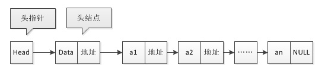
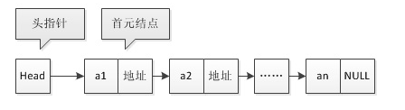
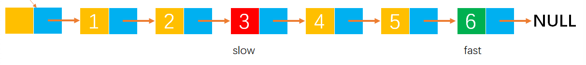
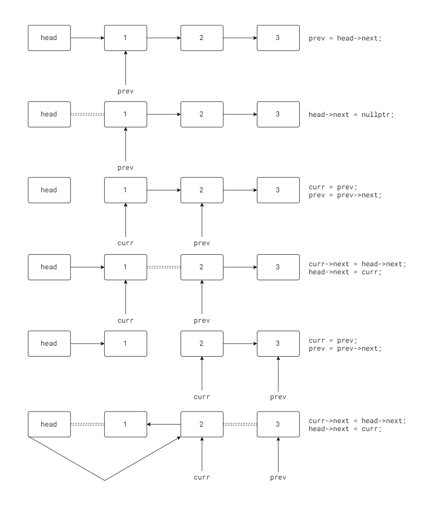

# 单链表的表示

## 单链表的定义

当链表的每个节点只包含一个指针域时，我们称之为单链表。

```cpp
struct LinkNode {
    Elemtype data;
    LinkNode *next;
};
typedef LinkNode *LinkList;
```

## 链表的头节点
头节点是单链表的第一个有效节点前附设的一个节点。指向头节点的指针称为头指针。首节点就是第一个有效节点。



**由于头指针仅仅是一个指针，它并没有数据域。头指针指向了头节点，头节点有数据域，但该数据域为空。**

链表也可以没有头节点。



- 链表的头节点并不存储数据。如果不带头节点，第一个节点需要单独处理。
  - 操作的对象不是第一个节点，需要将前一个节点的 next 指向后一个节点。
  - 操作的对象是第一个节点，需要更改链表的头指针指向下一个节点。
- 如果有头节点，则所有有效节点都不是第一个节点。只需将前一个节点的 next 指向后一个节点。

# 单链表的算法

## [寻找中间节点](https://leetcode.cn/problems/middle-of-the-linked-list/)

- 如果链表结点个数是奇数个，则显然 L/2+1 是中间节点。
- 如果链表节点个数是偶数个，则 L/2 和 L/2+1 都可以是中间节点。我们称 L/2 为靠左节点，L/2+1为靠右节点。

例如
- {1, 2, 3} 中 2 是中间节点。
- {1, 2, 3, 4} 中 2 和 3 都是中间节点，其中 2 靠左，3 靠右。

使用快慢指针的方式，快指针 fast 前进两步，慢指针 slow 前进一步，当 fast 到达链表尾时，slow 刚好到达链表中间。

如果链表有头节点，则头节点可以看作链表的一项。这意味着如果链表带头结点且有效项是 N 个，则链表总共就有 N+1 个节点。

假设现在存在某算法，在链表无头结点，有效节点个数是偶数个的情况下，该算法输出靠右节点。但在链表有头节点、有效节点个数为偶数情况下，把头节点计算在内，链表总共有奇数个节点。算法输出带头节点中间的节点，抛开头节点来看，此时输出节点是靠左的。



- 如果链表没有头节点，则下列代码输出靠右的节点。如果链表有头节点，则下列代码输出靠左的节点。
  
```cpp
LinkList GetMiddleRight(LinkList head) {
    LinkList fast = head;
    LinkList slow = head;
    while(fast && fast->next) {
        fast = fast->next->next;
        slow = slow->next;
    }
    return slow; 
}
```

- 如果链表没有头节点，则下列代码输出靠左的节点。如果链表有头节点，则下列代码错误，其输出不是中间节点。注意，while 中判断语句不能写成 fast->next->next && fast->next 。否则函数将不能对空链表给出正确输出。

```cpp
LinkList GetMiddleLeft(LinkList head) {
    LinkList fast = head;
    LinkList slow = head;
    while(fast->next && fast->next->next) {
        fast = fast->next->next;
        slow = slow->next;
    }
    return slow; 
}
```
---

## [逆置](https://leetcode.cn/problems/reverse-linked-list/)

给出一种典型的带头结点的链表原地逆置算法。对空链表输入，该函数能给出正确输出。

```cpp
LinkList Reverse(LinkList head) {
    LinkNode *prev, *curr;
    prev = head->next;
    head->next = nullptr;
    while(prev) {
        curr = prev;
        prev = prev->next;
        curr->next = head->next;
        head->next = curr;
    }
    return head;
}
```



在上述过程中，必须保存 prev ，否则将会丢失剩余的节点。prev 起到暂存的作用。head->next = pullptr 是不可或缺的，否则最后节点1会指向自己。