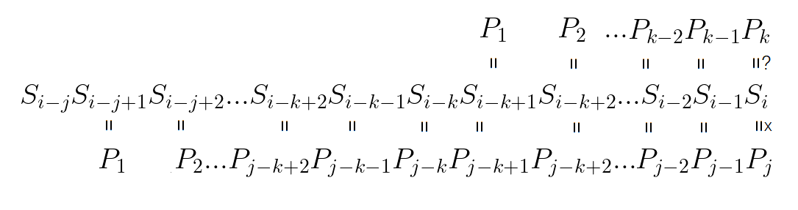
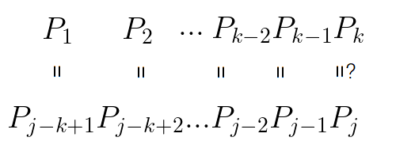
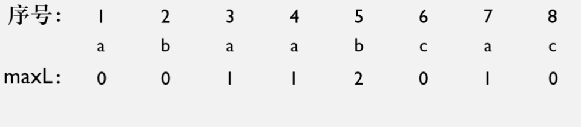
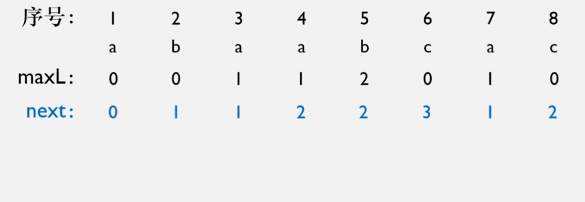

# 字符串的表示

## 字符串的定义

字符串是表示文本的一串字符。

## 定长顺序存储表示

```cpp
struct SString {
    char ch[MAX_STR_SIZE + 1];
    int length;
};
```

## 堆分配存储表示

```cpp
struct HString {
    char *ch;
    int length;
};
```


# 字符串的算法

下面给出两个模式匹配算法。假设文本串 txt 长度为 $n$，模式串 pat 长度为 $m$。

|算法|预处理时间|匹配时间|
|:-:|:-:|:-:|
|BF|$0$|$\mathrm{O}((n-m+1)m)$|
|KMP|$\Theta(m)$|$\Theta(n)$|

## 模式匹配算法: BF 算法

BF(Brute-Force)算法是一种暴力穷举的匹配算法。在最坏情况下，这种方法的运行时间约与 $\mathrm{MN}$ 成正比。但平均来说，这种方法的运行时间与 $\mathrm{M+N}$ 成正比。

```cpp
int IndexBF(String txt, String pat) {
    int i = 0, j = 0;
    while(i < txt.length && j < pat.length) {
        if(txt.ch[i] == pat.ch[j]) {
            i++;
            j++;
        } else {
            i = i - j + 1;
            j = 0;
        }
    }
    if(j >= pat.length)
        return i - pat.length;
    else
        return -1;
}
```

```java
public static int IndexBF(String txt, String pat) {
    int M = txt.length();
    int N = pat.length();
    for(int i = 0; i <= M - N; i++) {
        int j;
        for(j = 0; j < N; j++)
            if(txt.chat(i + j) != pat.chat(j))
                break;
        if(j == M)
            return i;
    }
    return -1;
}
```

## 模式匹配算法：[KMP 算法](https://blog.csdn.net/coding_with_smile/article/details/125521122)

KMP 算法是一种改进的字符串匹配算法。其效率优于 BF 算法。KMP 能利用匹配失败的信息减少模式模式串与文本串的匹配次数，从而增加匹配速度。

在 KMP 过程中，指针 i 不会回退。next[] 指示了模式串在主串该位置失配时，应该将模式串的哪一位与主串的该位置对齐。下面还将看到 nextval[] ，它的作用与 next[] 相同，但是比 next[] 更高效。

为与课本保持一致，除非特别指出，将始终认为字符串下标从 1 开始。

---

### KMP 算法中 next[] 原理

对于文本串 ababcabcacbab ,模式串 abcac，假设匹配进行到

```
ababcabcacbab  
--abcac  
------^ i=7, j=5
```

此时失配。如果使用 BF 算法，i j 将回溯，下一步将为

```
ababcabcacbab  
---abcac  
---^ i=4, j=1
```

这一步比较不必进行。事实上(i, j)[] = {(4, 1), (5, 1), (6, 1)} 的比较都是不必进行的。因为在上一次匹配中可以得知主串[4]、[5]必然是'b'、'c'，而模式串[1]是'a'，显然不匹配。主串[6]必然是'a'，与模式串[1]匹配，该比较也不需要进行。主串[7]与模式串[2]也是匹配的，但是在下一步比较前并不知道。可以不回溯指针 i，并且置指针 j = 2。

```
ababcabcacbab  
-----abcac  
------^ i=7, j=2
```

讨论一般情况。主串 $S_1S_2...S_n$ ，模式串 $P_0P_1...P_m$ ，在一匹配过程失配后($S_i\not ={P_j}$)，主串[i]需要与下一元素比较。假设下一元素是模式串[k]，下面将给出 k 的值 $(k < j)$。



通过上图可知，对于模式串的某前缀，如果该前缀前缀和后缀相同，则指针 j 可以重置。
- 前缀是指从最前字符开始，但不包括最后字符的子串。
- 后缀是指包括最后字符，但不从最前字符开始的子串。



对于模式串的某前缀，该前缀长度为j，该前缀的最长公共前后缀的长度是 k-1 ,则指针 j 应当置于 k。也就是说，如果现在比较到了 模式串[j]，则应当取到包含 模式串[j-1] 的前缀，查看该前缀的最长公共前后缀长度。如果长度为 l，那指针就置于 l+1。

令数组 next[j] 表明 模式串[j] 与 主串[i] 失配时，指针 j 应当重置到的位置。

$next[j]=\begin{cases}0&\text{if }j=1\\ l+1&\text{else}\end{cases}$


其中 $l$ 是模式串[j-1]的前缀的最长公共前后缀的长度。

l 需要加一是因为假定了字符串下标从 1 开始。对于字符串下标从 0 开始的实现，l 不需加 1，且 j = 0 时 next[j] = -1。

---

### KMP 算法中 nextval[] 原理

可以改进 next[] 使得效率更高。

|序号|1|2|3|4|5|
|:-:|:-:|:-:|:-:|:-:|:-:|
|字符|a|a|a|a|b|
|next|0|1|2|3|4|
|nextval|0|0|0|0|4|

给出一个主串 aaabaaaab，模式串 aaaab，假设匹配进行到

aaabaaaab  
-aaaab  
---^

此时失配。如果使用 next[]，此时 j 会置于 2。此后连续几次匹配都将失配。

```
aaabaaaab  
--aaaab  
---^
```

```
aaabaaaab  
---aaaab  
---^
```

```
aaabaaaab  
----aaaab  
---^
```

```
aaabaaaab  
----aaaab  
----^
```

至此字符串匹配成功。整个匹配效率很低，当第一次失配时，就可以得知主串此时不为 a。中间几次与 a 比较是不必要的。

由于计算next值时并不清楚当前位置的情况，最多只考虑到了冲突的前一位，可能导致移动后对齐的字符仍和上一个失配的字符相同，这样仍会失配。为此计算 nextval[] ，该数组只保留不同。

如果 模式串[i] 与 模式串[next[i]] 相同，则可以直接用 next[next[i]] 作为 nextval[i]。如果不同，则保留。

$nextval[j]=\begin{cases}next[j]&\text{if txt[j] != txt[next[j]]}\\ next[next[j]]&\text{if txt[j]==txt[next[j]]}\end{cases}$

---

### KMP 算法的手算

首先将手算 nextval[] 。对于字符串 abaabcac

|序号|1|2|3|4|5|6|7|8|
|:-:|:-:|:-:|:-:|:-:|:-:|:-:|:-:|:-:|
|字符|a|b|a|a|b|c|a|c|

首先列出模式串的所有前缀子串。对于每一前缀子串，在该字串中，求得该前缀中相等的最长公共前后缀的长度 maxL[i] 。

|序号|1|2|3|4|5|6|7|8|
|:-:|:-:|:-:|:-:|:-:|:-:|:-:|:-:|:-:|
|字符|a|b|a|a|b|c|a|c|
|maxL|0|0|1|1|2|0|1|0|


然后进行如下操作求得 next[]。

1. 去掉最后一个值。
2. 在开头补上 -1。
3. 向右平移一格。
4. 所有数值加 1。



|序号|1|2|3|4|5|6|7|8|
|:-:|:-:|:-:|:-:|:-:|:-:|:-:|:-:|:-:|
|字符|a|b|a|a|b|c|a|c|
|maxL|0|0|1|1|2|0|1|0|
|next|0|1|1|2|2|3|1|2|

然后进行如下操作求得 nextval[]。

1. 依次检查 模式串[i] 与 模式串 [next[i]] 是否相等。
- 如果不等，填入 next[i]。
- 如果相等，填入 next[next[i]]。

也可以用如下方法求得 nextval[]。

1. 第一个值设为 0。
2. 依次检查 maxL[i] 与 next[i] 是否相等。
- 如果不等，填入 next[i]。
- 如果相等，填入 nextval[next[i]]。



|序号|1|2|3|4|5|6|7|8|
|:-:|:-:|:-:|:-:|:-:|:-:|:-:|:-:|:-:|
|字符|a|b|a|a|b|c|a|c|
|maxL|0|0|1|1|2|0|1|0|
|next|0|1|1|2|2|3|1|2|
|nextval|0|1|0|2|1|3|0|2|

---

### KMP 算法的机算

穷举计算复杂度较高。在代码中将使用[其他思路](https://www.bilibili.com/video/BV1HT411V71d)。

对于模式串 abcdabecabcdab，公共前后缀部分已被加粗。添加一个未知字符'?'。

```
**abcdab**ec**abcdab**?  
^^^^^^--^^^^^^
```

如果字符'?'正好为 e，此时将前后缀部分分别向后延伸一格，它们仍然相同。如果相同，就找到了新的公共前后缀。则 next[16] = next[15] + 1，如下所示。

```
**abcdabe**c**abcdabe**  
^^^^^^^-^^^^^^^
```

如果字符'?'不为 e，则需要缩短加粗部分，前缀需要去掉末尾部分，后缀需要去掉开头部分；将缩短后的两块区域分别向后延伸一格，判断延伸后的两者是否仍相同。如果相同，就找到了新的公共前后缀。下面指出无需一个一个字符缩短，而可以在前缀中寻找该前缀的公共前后缀。

```
**abcdab**ec**abcdab**  
^^------^^  
----^^------^^  
^^----------^^  
^^--^^
```

前两行标注的部分应当分别相等，这是因为它们本来就是公共前后缀。第三行标注的部分也应当相等，这是因为我们是在这对公共前后缀中，进一步找到子公共前后缀；要满足寻找的条件，它们就必须相等。综合前三行，可以得出第四行所标注的部分是相等的。

这样，缩小加粗部分就转换为求公共前后缀的子公共前后缀。

|a|b|c|d|a|b|e|c|a|b|c|d|a|b|?|
|:-:|:-:|:-:|:-:|:-:|:-:|:-:|:-:|:-:|:-:|:-:|:-:|:-:|:-:|:-:|
|1|2|3|4|5|6|7|8|9|10|11|12|13|14|15|
|^|^|^|^|^|^|||^|^|^|^|^|^||

书接上文，如果字符'?'不为 e，则
1. 取得 next[15] = 7。
2. 访问 next[7]，取得 next[7] = 3。
3. 判断 txt[15] == txt[3]。
- 如果相等，循环结束，且 next[15] = 3。
- 如果不等，循环继续，取得 next[3] = 1。
4. 判断 txt[15] == txt[1] 。
- 如果相等，循环结束，且 next[15] = 1。
- 如果不等，循环仍然结束，因为 next[1] = 0。

在解析 next[j] 时，给出下列流程。
1. next[1] = 0, next[2] = 1。
2. 判断 txt[j - 1] == txt[next[j - 1]]。
- 如果相等，next[j] = next[j - 1] + 1。流程中止。
- 如果不等，继续流程。
3. 令 cur = next[j - 1]。
4. 判断 txt[j - 1] != txt[cur]。
- 如果不相等，进行下列流程。
    - 如果 cur == 0，转到第 5 步。
    - 令 cur = next[cur]。
    - 继续第 4 步。
- 如果相等，继续流程。
5. next[j] = cur + 1。流程中止。

下标从 0 开始的实现更接近实际。给出下列流程。
1. next[0] = -1, next[1] = 0。
2. 判断 txt[j - 1] == txt[next[j - 1]]。
- 如果相等，next[j] = next[j - 1] + 1。流程中止。
- 如果不等，继续流程。
3. 令 cur = next[j - 1]。
4. 判断 txt[j - 1] != txt[cur]。
- 如果不相等，进行下列流程。
    - 令 cur = next[cur]。
    - 如果 cur == -1，转到第 5 步。
    - 继续第 4 步。
- 如果相等，继续流程。
5. next[j] = cur + 1。流程中止。
   
nextval[] 的解析要简单得多，不再给出流程。

下列代码基于下标从 0 开始，附带 length 子成员的 String 实现。
```cpp
void getNext(String txt, int *&next) {
    next = (int*) malloc (sizeof(int) * txt.length);
    next[0] = -1;
    next[1] = 0;

    for(int index = 2; index < txt.length; index++) {
        char newChar = txt.ch[index - 1];
        if(newChar == txt.ch[next[index - 1]])
            next[index] = next[index - 1] + 1;
        else {
            int cur = next[index- 1];
            while(newChar != next[cur]) {
                cur = next[cur];
                if(cur == -1)
                    break;
            }
            next[index] = cur + 1;
        }
    }
}

void getNextval(String txt, int *next, int *&nextval) {
    nextval = (int*) malloc (sizeof(int) * txt.length);
    nextval[0] = -1;
    for(int index = 1; index < txt.length; index++) {
        nextval[index] = txt.ch[next[index]] == txt.ch[index] ? next[next[index]] : next[index];
    }
}

int IndexKMP(String txt, String pat) {
    int *next, *nextval;
    getNext(pat, next);
    getNextval(pat, next, nextval);
    int i = 0, j = 0;

    while(i < txt.length && j < pat.length) {
        if(txt.ch[i] == pat.ch[j]) {
            i++;
            j++;
        } else {
            j = nextval[j];
            if(j == -1) {
                j = 0;
                i++;
            }
        }
    }

    free(next);
    free(nextval);
    if(j >= pat.length)
        return i - pat.length;
    else
        return -1;
}
```

## 替换子字符串

给定待替换字符串 txt，函数将 txt 中的所有与 from 相同的子串替换为 to。

首先把 txt 复制给 right，然后进行如下循环：

- 用 Index() 查找 right 中是否有待替换的子串。如果有，该子串的头字符索引记为 index。注意，Index() 只能找到最靠前的子串，不能一次找到所有子串。
- 用 index 与 index + from.length 把字符串 txt 分为三部分：靠左的不需替换的子串 left，中间的待替换子串 from，靠右的待检测子串 right。
- 如果这是第一次循环，把 left 复制给 txt。如果不是，连接 txt 和 left。也可以在循环前先清空 txt，那样的话这一步就不需要判断，直接连接 txt 和 left。
- 连接 txt 和 to。

跳出循环后，连接 txt 和 right。

在整个流程中，不断把 right 切成更小的 right、from 与 left。left 可以直接连接到我们的答案后（第一次循环除外，这时需要先把答案串初始化）。我们指出，这么做是必须的，循环只能设定为从缩小的 right 中替换 from，而不能设定为从 txt 中替换 from。观察下面的例子：

txt = "123a123a";  
from = "12";  
to = "123";

如果设定为从 txt 中替换 from，显然这将是一个死循环。因此必须从 right 中替换 from。

```cpp
int Replace(String &txt, String from, String to) {
    int cnt = 0, index;
    SString left, right, ans;
    StrCopy(right, txt);
    while((index = IndexKMP(right, from)) != -1) {
        left = SubString(right, 0, index);
        right = SubString(right, index + from.length, right.length - index - from.length);
        if(cnt == 0) {
            StrCopy(txt, left);
        } else {
            ConCat(txt, txt, left);
        }
        ConCat(txt, txt, to);
        cnt++;
    }
    ConCat(txt, txt, right);
    return cnt;
}
```

或

```cpp
int Replace(SString &txt, SString from, SString to) {
    int cnt = 0, index;
    SString left, right, ans;
    StrCopy(right, txt);
    DestroyString(txt);
    while((index = IndexKMP(right, from)) != -1) {
        left = SubString(right, 0, index);
        right = SubString(right, index + from.length, right.length - index - from.length);
        ConCat(txt, txt, left);
        ConCat(txt, txt, to);
        cnt++;
    }
    ConCat(txt, txt, right);
    return cnt;
}
```