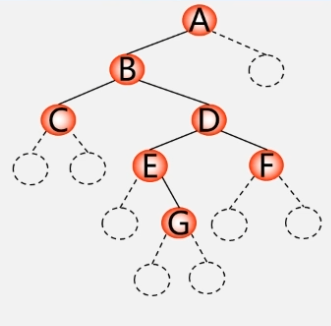

#   树

## 树的定义

树是 n 个节点的有限集。
- 若 n == 0，称为空树。
- 若 n > 0，则树必须满足如下条件。
    - 有且仅有一个特定的被称为根的节点。
    - 其余节点可分为 m 个互不相交的有限集，每个集合本身又是一棵树，并称为根的子树。

> 根节点：非空树中无前驱结点的结点。  

> 结点的度：结点拥有的子树的个数称为结点的度。  

> 树的度：树内各节点度的最大值称为树的度。  

> 叶子：度为 0 的终端结点。  

> 内部结点：度不为 0 的、根节点以外的分支节点、非终端结点。  

> 孩子、双亲：结点的子树的根称为该结点的孩子。该结点称为孩子的双亲。  

> 兄弟：有共同双亲的结点互称为兄弟结点。  

> 堂兄弟：双亲在同一层的结点。  

> 祖先：从根到该结点所经分支上的所有结点都称为祖先。  

> 深度：树中结点的最大层次。  

> 有序树：树中各结点的各子树从左到右有序。  

> 森林：m 棵互不相交树的集合。
> - 删除根结点，各个子树是一片森林。
> - 一棵树可以看成一个森林，即 m 可以为 1。
> - 给森林中的各子树加上一个双亲，森林即变成树。

# 二叉树的表示

## 二叉树的定义

每个结点最多有两个分支的树称为二叉树。可以证明，所有树都可以转化为唯一对应的二叉树。普通树如果不转化为二叉树，则运算很难实现。

二叉树是 n 个结点的有限集，它要么是空集，要么由一个根节点及两棵互不相交的子二叉树构成，分别称作这个根的左子树和右子树。  
二叉树的每个结点最多有两个孩子，即二叉树的度最大为 2。二叉树是有序树，其子树的次序不能颠倒。二叉树还可以是空集，其孩子为空左子树、空右子树。

与无序树不同，二叉树结点的子树必须区分左子树和右子树，即使只有一棵子树也必须区分左右。举例来说，拥有三个结点的二叉树可能有五种形态，而普通树只有两种可能的形态。

二叉树有顺序存储和链式存储两种存储方法。

顺序存储适合存储满二叉树和完全二叉树，在存储其他二叉树时空间利用率较低。

```cpp
#define MAX_TREE_SIZE 128
typedef int SqBiTree[MAX_TREE_SIZE];
```

链式存储常用得多。下列所示的实现称为二叉链表。

```cpp
typedef struct BiNode {
    int val;
    BiNode *lchild, *rchild;
}*BiTree;
```

有时可以再增加一个指针域，新增加的指针指向双亲。这样的二叉树实现称为三叉链表。

```cpp
typedef struct BiNode {
    int val;
    BiNode *lchild, *parent, *rchild;
}*BiTree;
```

## 二叉树的性质

1. 在二叉树的第 $i(i>0)$ 层上至多有 $2^{i-1}$ 个结点。
2. 深度为 $k(k>0)$ 的二叉树至多有 $2^k-1$ 个结点。
3. 对任何一棵二叉树，若其叶子数为 $n_0$，度为 2 的结点数为 $n_2$，则 $n_0=n_2+1$。或者说度为 0 的结点个数等于度为 2 的结点个数加 1。
4. 具有 $n$ 个结点的完全二叉树的深度为 $\lfloor log_2{n}\rfloor+1$。
5. 如果对一棵有 $n$ 个结点的完全二叉树的结点编号，则对任一结点 $i$，有
   - 如果 $i=1$，则结点 $i$ 是二叉树的根，无双亲；如果 $i>1$，则其双亲是节点 $\lfloor \frac{i}{2}\rfloor$。
   - 如果 $2i>n$，则结点 $i$ 为叶子结点，无左孩子；如果 $2i\leqslant n$，则结点的左孩子是结点 $2i$。
   - 如果 $2i+1>n$，则结点 $i$ 无右孩子；如果 $2i+1\leqslant n$，则结点的右孩子是结点 $2i+1$。

## 特殊二叉树

### 满二叉树

一棵深度为 $k$ 且有 $2^{k-1}$ 个结点的二叉树称为满二叉树。
- 每一层结点数都最大。
- 叶子结点全部在最底层。
- 非叶子结点的度全为 2。
- 可以对二叉树的结点进行编号。从根结点开始，从上往下、从左往右。
- 一定是完全二叉树。

### 完全二叉树

一棵深度为 $k$ 的具有 $n$ 个结点的二叉树，当且仅当其每一个节点都与深度为 $k$ 的满二叉树中编号为 1~n 的结点一一对应时，称为完全二叉树。
- 在满二叉树中，从最后一个结点开始连续去掉任意个结点，就得到一棵完全二叉树。
- 叶子结点只能出现在最下两层。
- 最下层的叶子一定集中在左部连续位置。
- 倒数两层，若有叶子结点，一定都在左部连续位置。
- 如果结点的度为 1，则该结点必只有左孩子。
- 同样结点数的二叉树，完全二叉树深度最小。
- 可能是满二叉树。

# 二叉树的遍历

下面有几种遍历二叉树的算法。

- [先序遍历二叉树](https://leetcode.cn/problems/binary-tree-preorder-traversal/)
  - 若二叉树为空，则空操作返回。否则
    1. 访问根节点；
    2. 先序遍历左子树；
    3. 先序遍历右子树。
- [中序遍历二叉树](https://leetcode.cn/problems/binary-tree-inorder-traversal/)
  - 若二叉树为空，则空操作返回。否则
    1. 中序遍历左子树；
    2. 访问根节点；
    3. 中序遍历右子树。
- [后序遍历二叉树](https://leetcode.cn/problems/binary-tree-postorder-traversal/)
  - 若二叉树为空，则空操作返回。否则
    1. 后序遍历左子树；
    2. 后序遍历右子树；
    3. 访问根节点。
- 层次遍历二叉树
  - 从根结点开始，按从上到下、从左到右顺序访问每一个结点。

## 由遍历序列确定二叉树

由二叉树的先序序列和中序序列，或者由二叉树的后序序列和中序序列，可以确定唯一一棵二叉树。然而由二叉树的先序序列和后序序列无法确定唯一一棵二叉树。

### 由先序序列和中序序列确定二叉树

- 先序序列的首结点是二叉树的根。
- 中序序列根左边的结点是二叉树的左子树，根右边的节点是二叉树的右子树。

通过递归地使用上两条性质，可以确定二叉树。

例如，对于  
先序序列 ABCDEFGHIJ  
中序序列 CDBFEAIHGJ  
使用性质 1，根节点是 A。  
使用性质 2，二叉树的左子树有结点 CDBFE，右子树有结点 IHGJ。  
使用性质 1，左子树的根节点是 B，右子树的根节点是 G。  
使用性质 2，左子树的左子树有结点 CD，左子树的右子树有结点 FE，右子树的左子树有结点 IH，右子树的右子树有结点 J。  
...   
重复以上递归，就能确定二叉树。

### 由中序序列和后序序列确定二叉树

- 后序序列的尾结点是二叉树的根。
- 中序序列根左边的结点是二叉树的左子树，根右边的节点是二叉树的右子树。

通过递归地使用上两条性质，可以确定二叉树。

例如，对于  
中序序列 BDCEAFHG  

后序序列 DECBHGFA  
使用性质 2，根节点是 A。  
使用性质 1，二叉树的左子树有结点 BDCE，右子树有结点 FHG。  
使用性质 2，左子树的根节点是 B，右子树的根节点是 F。
使用性质 1，左子树的左子树无结点，左子树的右子树有结点 DCE。右子树的左子树无结点，右子树的右子树有结点 HG。  
...   
重复以上递归，就能确定二叉树。

## 递归遍历二叉树

### 先序遍历二叉树

```cpp
Status PreOrderTraverse(BiTree root, Status (*Visit)(int elem)) {
    if(!root)
        return OK;
    if(Visit(root->val))
        if(PreOrderTraverse(root->lchild, Visit))
            if(PreOrderTraverse(root->rchild, Visit))
                return OK;
    return ERROR;
}
```

### 中序遍历二叉树

```cpp
Status InOrderTraverse(BiTree root, Status (*Visit)(int elem)) {
    if(!root)
        return OK;
    if(InOrderTraverse(root->lchild, Visit))
        if(Visit(root->val))
            if(InOrderTraverse(root->rchild, Visit))
                return OK;
    return ERROR;
}
```

### 后序遍历二叉树

```cpp
Status PostOrderTraverse(BiTree root, Status (*Visit)(int elem)) {
    if(!root)
        return OK;
    if(PostOrderTraverse(root->lchild, Visit))
        if(InOrderTraverse(root->rchild, Visit))
            if(Visit(root->val))
                return OK;
    return ERROR;
}
```

## 迭代遍历二叉树

### 先序遍历二叉树

先序遍历的遍历顺序是根左右，先处理中间节点，然后将右孩子入栈，最后将左孩子入栈，这样保证了出栈顺序是根左右。  
令根结点入栈，访问栈顶元素，然后令栈顶出栈，并依次使结点右孩子、左孩子入栈（如果存在的话）。之后，再重复上述操作，访问栈顶元素后栈顶元素出栈，依次使右孩子、左孩子入栈，如此循环直到栈空。  
注意，每次入栈前必须先判断要入栈的结点是否存在。如果不存在，则不予入栈。


```cpp
Status PreOrderTraverse(BiTree root, Status (*Visit)(int elem)) {
    if(!root)
        return OK;
    SqStack<BiTree> st;
    Init(st);
    Push(st, root);
    BiTree curr;
    while(!IsEmpty(st)) {
        Pop(st, curr);
        if(!Visit(curr->val))
            return ERROR;
        if(curr->rchild)
            Push(st, curr->rchild);
        if(curr->lchild)
            Push(st, curr->lchild);
    }
    return OK;
}
```

```cpp
class Solution {
public:
    vector<int> PreOrderTraverse(TreeNode* root) {
        vector<int> ans;
        if(!root)
            return ans;
        stack<TreeNode*> st;
        st.push(root);
        TreeNode *curr;

        while(!st.empty()) {
            curr = st.top();
            st.pop();
            ans.push_back(curr->val);
            if(curr->right)
                st.push(curr->right);
            if(curr->left)
                st.push(curr->left);
        }
        return ans;
    }
};
```

### 中序遍历二叉树

先序遍历的非递归算法与中序遍历的非递归算法有显著区别，前者的逻辑无法直接应用到后者上。  
先序遍历的顺序是根左右，要访问的元素和要处理的元素顺序是一致的，先访问的元素是中间节点，要处理的元素也是中间节点，也就是说每访问一个结点，就要处理它。所以代码相对简洁。  
中序遍历的顺序是左根右，先访问的是二叉树的根，然后一层一层向下访问，直到到达树左面的最底部，再开始处理节点，其处理顺序和访问顺序不一致。

算法的思路是这样的。声明一个指针 curr 指向根结点。然后，当栈 st 和指针 curr 不都空时，如果 curr 不空，让 curr 入栈 st，并把 curr 滑向它的左孩子。如果 curr 空，把出 st 栈元素赋给 curr，处理 curr，并把 curr 滑给它的右孩子。


思考如此设定的效果。循环的条件为 curr 不空或 st 不空。最开始时，当 curr 不空，说明当前还没有到达树当前的最左下角。这个时候应该把 curr 滑向 curr 的左结点，一路上入栈记录所有滑过的结点。当 curr 空，说明此时 curr 来到了最左下角，这是一个空结点。此时栈顶弹出一个元素，它恰是空结点的双亲。双亲的左孩子是空结点，接下来要做的就是处理该双亲，并把指针滑向右孩子。

通过下图理解中序遍历的顺序。从某一次 curr 指针置空到下一次 curr 指针置空可以看作是一个过程，在图中，该过程由先绿后蓝的倒L形曲线表示，绿色表示此时 curr 为空，并令 curr 等于出栈结点的右孩子；蓝色表示此时 curr 正在一路左滑，并入栈所有沿途的结点。每当一个结点伸出了倒L型曲线，就说明应该处理该结点了。


从这张图上可以理解该算法的正确性。每当 curr 不空，就把 curr 一路左滑；每当 curr 为空，此时应该处理弹出栈顶结点，从栈顶结点的右孩子继续一路左滑。每个结点都会在指针左滑时进栈一次并且只会进栈这一次，每个结点都会出栈，每个结点都会按正确的顺序伸出一条绿曲线，我们总能按中序序列处理所有元素。

```cpp
Status InOrderTraverse(BiTree root, Status (*Visit)(int elem)) {
    if(!root)
        return OK;
    SqStack<BiTree> st;
    Init(st);
    BiTree curr = root;
    while(curr || !IsEmpty(st)) {
        if(curr) {
            Push(st, curr);
            curr = curr->lchild;
        } else {
            Pop(st, curr);
            if(!Visit(curr->val))
                return ERROR;
            curr = curr->rchild;
        }
    }
    return OK;
}
```

```cpp
class Solution {
public:
    vector<int> InOrderTraverse(TreeNode* root) {
        vector<int> ans;
        if(!root)
            return ans;
        stack<TreeNode*> st;
        TreeNode *curr = root;
        while(curr || !st.empty()) {
            if(curr) {
                st.push(curr);
                curr = curr->left;
            } else {
                curr = st.top();
                st.pop();
                ans.push_back(curr->val);
                curr = curr->right;
            }
        }
        return ans;
    }
};
```

### 后序遍历二叉树

后序遍历的顺序是左右根，调整一下先序遍历的代码顺序，可变成根右左的遍历顺序，然后借助栈反转输出，就可以按左右根顺序输出。

```cpp
Status PostOrderTraverse(BiTree root, Status (*Visit)(int elem)) {
    if(!root)
        return OK;
    SqStack<BiTree> st, ans;
    Init(st);
    Init(ans);
    Push(st, root);
    BiTree curr;
    while(!IsEmpty(st)) {
        Pop(st, curr);
        Push(ans, curr);
        if(curr->lchild)
            Push(st, curr->lchild);
        if(curr->rchild)
            Push(st, curr->rchild);
    }
    while(!IsEmpty(ans)) {
        Pop(ans, curr);
        if(!Visit(curr->val))
            return ERROR;
    }
    return OK;
}
```

```cpp
class Solution {
public:
    vector<int> PostOrderTraverse(TreeNode* root) {
        vector<int> ans;
        if(!root)
            return ans;
        stack<TreeNode*> st;
        st.push(root);
        TreeNode *curr;
        while(!st.empty()) {
            curr = st.top();
            st.pop();
            ans.push_back(curr->val);
            if(curr->left)
                st.push(curr->left);
            if(curr->right)
                st.push(curr->right);
        }
        reverse(ans.begin(), ans.end());
        return ans;
    }
};
```

### 层次遍历二叉树

层次遍历可借助一个队列实现。
- 令根结点入队。
- 队不空时作如下循环。从队列出队一个节点，访问它。并令出队结点的左孩子和右孩子分别入队（如果这些节点存在）。  
这样就完成了层次遍历。

```cpp
Status LevelOrderTraverse(BiTree root, Status (*Visit)(int elem)) {
    if(!root)
        return OK;
    SqQueue<BiTree> sq;
    Init(sq);
    Push(sq, root);
    BiTree curr;
    while(!IsEmpty(sq)) {
        Pop(sq, curr);
        if(!Visit(curr->val))
            return ERROR;
        if(curr->lchild)
            Push(sq, curr->lchild);
        if(curr->rchild)
            Push(sq, curr->rchild);
    }
    return OK;
}
```

# 二叉树的算法

## 二叉树的创建

### 先序建立二叉树

正如前文所述，先序遍历序列加上中序遍历序列才能唯一确定一棵二叉树。这意味着同一种先序遍历序列可能有多种符合的二叉树。  
为了仅通过先序遍历序列唯一确定二叉树，输入需要显式地给出空结点。

例如对于如下二叉树  
  
其先序遍历序列为 ABCDEGF，其先序建立序列为 ABC##DE#G##F###。   


```cpp
Status PreOrderCreate(BiTree &root) {
    int num;
    scanf("%d", &num);
    if(num == -1)
        root = nullptr;
    else {
        root = (BiTree) malloc (sizeof(BiNode));
        if(!root)
            exit(OVERFLOW);
        root->val = num;
        PreOrderCreate(root->lchild);
        PreOrderCreate(root->rchild);
    }
    return OK;
}
```

## 二叉树的复制

```cpp
Status Copy(BiTree root, BiTree &nroot) {
    if(!root) {
        nroot = nullptr;
        return OK;
    }
    nroot = (BiTree) malloc(sizeof(BiNode));
    nroot->val = root->val;
    Copy(root->lchild, nroot->lchild);
    Copy(root->rchild, nroot->rchild);
    return OK;
}
```

## 求二叉树深度

```cpp
int Depth(BiTree root) {
    if(!root)
        return 0;
    int m = Depth(T->lchild);
    int n = Depth(T->rchild);
    return m > n ? m + 1 : n + 1; 
}
```

 ## 求结点总个数

```cpp
int NodeCount(BiTree root) {
    if(!root)
        return 0;
    return NodeCount(T->lchild) + NodeCount(T->rchild) + 1;
}
```

## 求叶子结点个数

```cpp
int LeafCount(BiTree root) {
    if(!root)
        return 0;
    if(!root->lchild && !root->rchild)
        return 1;
    return LeafCount(T->lchild) + LeafCount(T->rchild);
}
```

# 线索二叉树

当用二叉链表作为二叉树的存储结构时，可以很方便地找到某结点的左右孩子。但一般情况下，无法直接找到该结点在某种遍历序列中的前驱和后继结点。

可以通过遍历寻找特定结点的前驱和后继，或是额外增添两个指针指示前驱和后继。但这样做会增大程序的时间或存储负担。

二叉链表的许多指针域是空的。我们指出可以利用这些空指针域来存储前驱或后继。  
具有 n 个结点的二叉链表中一共有 2n 个指针域。而 n 个结点共有 n - 1 个孩子，其余 n + 1 个指针域都空。   
这些空指针域可被利用。如果某个结点的左孩子为空，则将左孩子指向其前驱；如果某结点的右孩子为空，则将右孩子指向其后继。

这种改变指向的指针称为线索。加上线索的二叉树被称为线索二叉树。对二叉树按某种遍历次序使其变为线索二叉树的过程叫做线索化。

为了区分 lchild 和 rchild 究竟指向左右孩子还是指向前驱后继，对二叉链表中每个结点增设两个标志域 ltag 和 rtag，约定
- ltag = 0 -> lchild 指向该结点的左孩子
- ltag = 1 -> lchild 指向该结点的前驱
- rtag = 0 -> rchild 指向该结点的右孩子
- rtag = 1 -> rchild 指向该结点的后继

现在二叉树中仍有两个指针域为空。现增设一个头结点，对于该头节点约定
- ltag = 0, lchild 指向根结点
- rtag = 1, rchild 指向遍历序列中最后一个结点  
且约定遍历序列中第一个结点的 lchild 和最后一个结点的 rchild 都指向该头结点。头结点的出现能简化操作。

```cpp
typedef struct BiThrNode {
    int val;
    BiThrNode *lchild, *rchild;
    int ltag, rtag;
}*BiThrTree;
```
以下代码均假定线索二叉树的实现附带头结点。

## [先序线索二叉树](https://blog.csdn.net/weixin_39956356/article/details/80142461)

### 先序线索化

先序线索化是在先序遍历过程中动态地为每个结点添加前驱或后继信息，可随着一次一般二叉树先序遍历完成。  
可以声明一个静态变量指针 pre，它指示上一个访问到的结点。然后进行递归。它的开头处理函数为
- 每当遇到一个结点左孩子为空，将该结点 ltag 置 1，并将该结点左孩子设为 pre，即该结点的前驱节点。
- 每当遇到 pre 有孩子为空，将该结点 rtag 置 1，并将 pre 的右孩子设为 root，即 pre 的后继结点。  
这里，我们在递归时必须判断当前结点的 ltag、rtag 是否为 0，这是因为先序遍历的处理先于递归。
  - 检查 ltag 是否为 0 是必须的。在左递归发生时，该结点已经被处理过。假设不判断当前节点的 ltag，若结点的左子树为空，则处理函数把它指向前驱，函数不断向左子树递归，形成死循环。  
  - 检查 rtag 是否为 0 是必须的。假设某个结点 A，该结点有左孩子 B，无右孩子，结点 B 没有左右孩子
    - A 左递归后，函数执行到 B，此时处理函数把 B 的左孩子设为 A，又把 A 的右孩子设为 B。
    - 因为 B 的 ltag == 1，B 不会左递归，而是直接右递归。处理函数进入 B 的右孩子，这是一个空结点，函数退出。
    - 此时进行 A 的右递归。函数来到 A 的右结点。该结点是 B，形成死循环。  

只需稍微修改先序遍历算法，就能实现它。正如下方的 PreThreading()。

还有一个问题，需要创建头结点，并把第一个结点的 lchild 和最后一个结点的 rchild 都指向该头结点。在同一个递归函数中实现这些存在困难，我们选择使用另一个函数调用递归函数。如下所示，定义了 PreOrderThreading()。这个函数
- 创建一个头结点 nroot，其 ltag 为 0，rtag 为 1。
- 如果待线索化的二叉树为空，它将头结点的左右孩子都指向自身。
- 如果待线索化的二叉树不空 
  - 首先把 pre 初始化为 nroot，因为约定了遍历序列的第一个结点的 lchild 要指向头结点。
  - 把 nroot 的左孩子设为 root，因为约定了头结点的 lchild 指向根结点。
  - 调用 PreThreading() 进行递归。递归后 pre 指向遍历序列的最后一个结点。
  - 把 pre 的 rtag 置 1，并令其指向 nroot，因为约定了遍历序列的最后一个结点的 rchild 要指向头结点。
  - 把 nroot 的右孩子设为 pre，因为约定了头结点的 rchild 指向遍历序列的最后一个结点。  

这样，借助这个函数能解决一系列的小问题。

```cpp
BiThrTree pre;
Status PreThreading(BiThrTree root) {
    if(!root)
        return OK;
    if(!root->lchild) {
        root->ltag = 1;
        root->lchild = pre;
    }
    if(pre && !pre->rchild) {
        pre->rtag = 1;
        pre->rchild = root;
    }
    pre = root;
    if(!root->ltag)
        PreThreading(root->lchild);
    if(!root->rtag)
        PreThreading(root->rchild);
    return OK;
}

Status PreOrderThreading(BiThrTree &nroot, BiThrTree root) {
    nroot = (BiThrTree) malloc (sizeof(BiThrNode));
    if(!nroot)
        exit(OVERFLOW);
    nroot->ltag = 0;
    nroot->rtag = 1;
    if(!root) {
        nroot->lchild = nroot;
        nroot->rchild = nroot;
        return OK;
    }
    nroot->lchild = root;
    pre = nroot;
    PreThreading(root);
    pre->rchild = nroot;
    pre->rtag = 1;
    nroot->rchild = pre;
    return OK;
}
```

### 先序遍历

在先序迭代遍历一般二叉树的过程中，利用栈模拟了递归。首先令根结点入栈，接着当栈不空，即让根结点出栈、并处理之，根结点的子结点以右左的顺序进栈。  
先序遍历线索二叉树不再需要栈，代码比较简单。先序遍历总是遍历最左方的子树，可以这样设计代码
- 声明指针 curr，置初值 root->lchild。这是因为 root 是头结点，root->lchild 才是根。
- 当 curr 不等于 root，进行如下循环
  - 当 curr 的 ltag 为 0，此时 curr 可以不断左推。处理 curr 并将其左推。
  - curr 不再左推时，此时 curr 已经左推到底。处理 curr（在上一循环中没有处理该结点），如果 curr 的 ltag 为 1，则把 curr 推给右节点。

这样，能从最左方开始，依次以先序遍历所有结点。

```cpp
Status PreOrderTraverse(BiThrTree root, Status(*Visit)(int elem)) {
    if(!root)
        return OK;
    BiThrTree curr = root->lchild;
    while(curr != root) {
        while(!curr->ltag) {
            if(!Visit(curr->val))
                return ERROR;
            curr = curr->lchild;
        }
        if(!Visit(curr->val))
            return ERROR;
        curr = curr->rchild;  
    }
    return OK;
}
```

## 中序线索二叉树

### 中序线索化

中序线索化可随着一次一般二叉树中序遍历完成。  
可以声明一个静态变量指针 pre，它指示上一个访问到的结点。然后进行递归。它的中间处理函数为
- 每当遇到一个结点左孩子为空，将该结点 ltag 置 1，并将该结点左孩子设为 pre，即该结点的前驱节点。
- 每当遇到 pre 有孩子为空，将该结点 rtag 置 1，并将 pre 的右孩子设为 root，即 pre 的后继结点。

只需稍微修改中序遍历算法，就能实现它。正如下方的 InThreading()。

还有一个问题，需要创建头结点，并把第一个结点的 lchild 和最后一个结点的 rchild 都指向该头结点。在同一个递归函数中实现这些存在困难，我们选择使用另一个函数调用递归函数。如下所示，定义了 InOrderThreading()。这个函数
- 创建一个头结点 nroot，其 ltag 为 0，rtag 为 1。
- 如果待线索化的二叉树为空，它将头结点的左右孩子都指向自身。
- 如果待线索化的二叉树不空
  - 首先把 pre 初始化为 nroot，因为约定了遍历序列的第一个结点的 lchild 要指向头结点。
  - 把 nroot 的左孩子设为 root，因为约定了头结点的 lchild 指向根结点。
  - 调用 InThreading() 进行递归。递归后 pre 指向遍历序列的最后一个结点。
  - 把 pre 的 rtag 置 1，并令其指向 nroot，因为约定了遍历序列的最后一个结点的 rchild 要指向头结点。
  - 把 nroot 的右孩子设为 pre，因为约定了头结点的 rchild 指向遍历序列的最后一个结点。

这样，借助这个函数能解决一系列的小问题。

```cpp
BiThrTree pre;
Status InThreading(BiThrTree root) {
    if(!root)
        return OK;
    InThreading(root->lchild);
    if(!root->lchild) {
        root->ltag = 1;
        root->lchild = pre;
    }
    if(pre && !pre->rchild) {
        pre->rtag = 1;
        pre->rchild = root;
    }
    pre = root;
    InThreading(root->rchild);
    return OK;
}

Status InOrderThreading(BiThrTree &nroot, BiThrTree root) {
    nroot = (BiThrTree) malloc (sizeof(BiThrNode));
    if(!nroot)
        exit(OVERFLOW);
    nroot->ltag = 0;
    nroot->rtag = 1;
    if(!root) {
        nroot->rchild = nroot;
        nroot->lchild = nroot;
        return OK;
    }
    nroot->lchild = root;
    pre = nroot;
    InThreading(root);
    pre->rchild = nroot;
    pre->rtag = 1;
    nroot->rchild = pre;
    return OK;
}
```

### 中序遍历

在一般二叉树的中序非递归遍历算法中，声明了一个指针 curr，初值为 root。当 curr 不空，用栈 st 记录过指针一路左滑过的每一个结点。当 curr 空，此时左滑到底，令 curr 等于出栈元素的右结点，同时处理该结点。  
容易看到，栈起到了记录下一遍历结点的作用。在线索二叉树的遍历算法中，由于记录了下一遍历结点，将不再需要声明栈。
- 声明指针 curr。curr 初值为 root 的左孩子，由于 root 是头结点，此时 curr 仍是根结点。
- 遍历序列最后元素的右孩子是头结点，因而 curr == root 是循环结束的标志。当 curr != root 时
  - 如果 curr 的 ltag 为 0，则令 curr 一路继续左滑。
  - 此时 curr 指向左下角。处理 curr 指向的结点。
  - 如果 curr 的 rtag 为 1，则 curr 的 rchild 就指向下一个需要处理的结点（除非这个结点是 root，因为 root 的 rtag 也是 1）。在此期间处理访问的每一个结点。
  - 退出循环时 curr 的 rtag 为 0，或者 rchild 指向了 root。如果 curr 的 rtag 为 0，则此时 curr 必有右孩子，下一步应访问又孩子。如果指向 root，那把 curr 推向 root 就能结束循环。综上应该把 curr 向右推一个结点。

```cpp
Status InOrderTraverse(BiThrTree root, Status (*Visit)(int elem)) {
    if(!root)
        return OK;
    BiThrTree curr = root->lchild;
    while(curr != root) {
        while(curr->ltag == 0) {
            curr = curr->lchild;
        }
        if(!Visit(curr->val))
            return ERROR;
        while(curr->rtag == 1 && curr->rchild != root) {
            curr = curr->rchild;
            if(!Visit(curr->val))
                return ERROR;
        }
        curr = curr->rchild;
    }
    return OK;
}
```