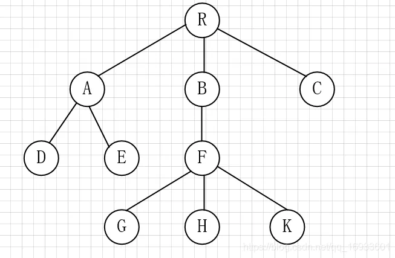
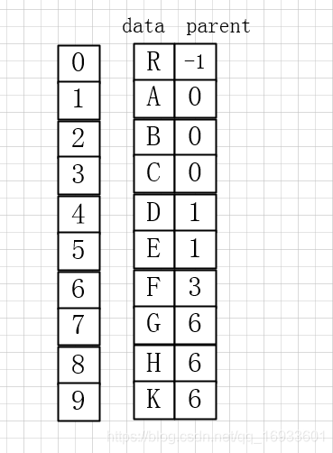
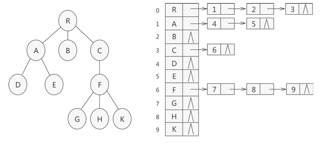

# 树

树是 $n(n\geqslant0)$ 个结点的有限集。若 n = 0，称为空树。树的所有结点都有唯一的父节点，但是每个结点都有不确定数量的子结点。  
若 $n>0$，有且仅有一个被称为根的结点，且其余结点可分为 $m(m\geqslant0)$ 个互不相交的有限集。

## 树的表示

### 双亲表示

可以借助结构数组实现。  
结构数组存放树的结点，每个结点含两个域：
- 数据域，存放结点本身信息。
- 双亲域，指示本结点的双亲结点在数组中的位置。




```cpp
struct PTNode {
    int val;
    int parent;
};
struct PTree {
    PTNode nodes[MAX_TREE_SIZE];
    int r, n;
};
```

### 孩子表示

孩子表示法用一组连续的存储空间来存放树的所有结点，每个空间存放一个结点的信息；但是附加信息不再存放本结点的双亲结点的位置信息，而是存放本结点的孩子结点的位置信息。由于树的结点可能会有多个孩子结点，因此孩子结点的位置信息无法直接存放，可以把每个结点的孩子结点的位置信息排列起来成为一个线性表，以单链表作为存储结构（这样n个结点就有n个孩子链表），每个结点的附加信息里存放上本结点的孩子链表的地址信息。

孩子表示法也用一组连续的存储空间来存放树的所有结点，每个空间存放一个结点的信息；但是附加信息不再存放本结点的双亲结点的位置信息，而是存放本结点的孩子结点的位置信息。由于树的结点可能会有多个孩子结点，因此孩子结点的位置信息无法直接存放，可以把每个结点的孩子结点的位置信息排列起来成为一个链表。n 个结点就有 n 个孩子链表，每个结点的附加信息里存放上本结点的孩子链表的地址信息。

为方便起见，同时存储结点个数 n 和 根结点下标 r。



```cpp
struct CTNode { // 孩子结点
    int child;
    CTNode *next;
}*ChildPtr;
struct CTBox { // 双亲结点
    int val;
    ChildPtr firstchild;
};
struct CTree { // 树
    CTBox nodes[MAX_TREE_SIZE];
    int n, r;
};
```

### 二叉链表表示法

可以使用二叉链表用作树的存储结构，链表中每结点的左指针域指向其首孩子结点，右指针域指向下一兄弟结点。这样，树退化为二叉树存储。  

```cpp
typedef struct CSNode {
    int data;
    CSNode *firstchild, *nextsibling;
}*CSTree;
```

## 树与二叉树的转换

树和二叉树都可用二叉链表存储，因而可以相互转化。  

### 把树转换为二叉树

1. 在兄弟结点间加上连线。
2. 对每个结点，除其最左孩子外，去除其与其他孩子之间的联系。

### 把二叉树转换为树

1. 若某结点是其双亲的右孩子，则将该结点的右孩子、右孩子的右孩子...沿分支找到的所有右孩子都与该结点的双亲连接。
2. 去除原二叉树中双亲与右孩子之间的联系。
3. 将结点按层次排列，形成树结构。

# 森林

森林是 $m(m\geqslant0)$ 棵互不相交的树的集合。 

## 森林转换为二叉树

使用二叉链表表示树时，由于根结点没有兄弟结点，所以根结点的右子树为空。可以让右指针指向其他树的根结点，这样可以把森林转换为二叉树。
