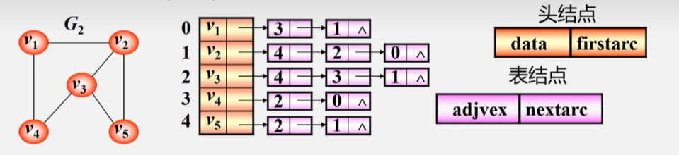
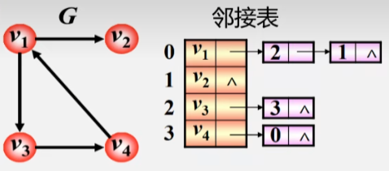
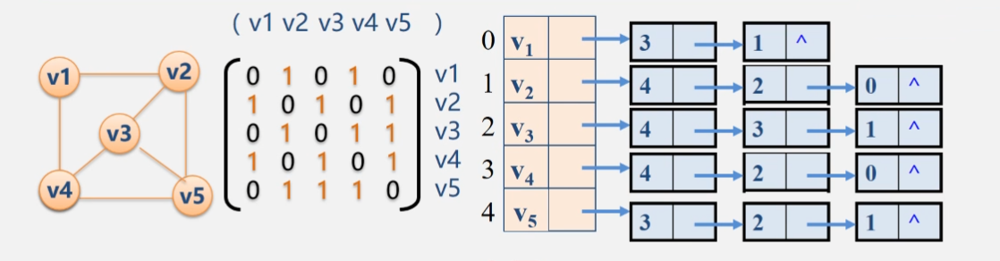
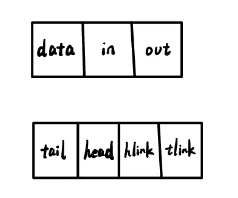
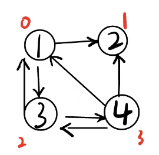
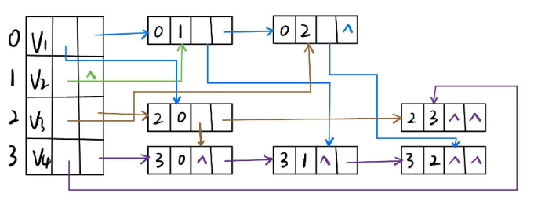

# 图的定义

## 图的相关概念

数据的逻辑结构大致可分为四类。

> 集合：数据元素同属于一个集合，无顺序关系。

> 线性结构：有序数据元素的集合。给定一个元素，它至多有一个前驱、一个后继。如线性表、栈、队列、数组、串。

> 树形结构：给定一个元素，它至多有一个前驱，可能有任意多个后继。

> 图形结构：给定一个元素，它可能有任意多个前驱，任意多个后继。

图 Graph = (Vertex, Edge)。其中 Vertex 是顶点（即数据元素）的有穷非空集合，Edge 是边的有穷集合。

> 无向图：每条边都是无方向的。

> 有向图：每条边都是有方向的。

> 完全图：任意两顶点之间都有边相连。
> - 在无向图中有一条边相连，在有向图中有两条边相连。
> - 有 $n$ 顶点的无向完全图有 $\frac{n(n-1)}{2}$ 条边，有 $n$ 顶点的有向完全图有 $n(n-1)$ 条边。

> 弧：有向图的带箭头的边也被称为弧。

> 稀疏图：边或弧很少($e<n\log n$)的图。

> 稠密图：边或弧很多的图。

> 邻接：有边或弧相连的两个顶点之间的关系。
> - 对于无向图存在偶对 ($v_i, v_j$)，则称互为邻接点。
> - 对于有向图存在序偶 <$v_i, v_j$>，则称 $v_i$ 邻接到 $v_j$，$v_j$ 邻接于 $v_i$。

> 关联/依附：边或弧与顶点之间的关系。
> - 如果存在 ($v_i, v_j$) 或 <$v_i, v_j$>，则称该边或弧关联于 $v_i$ 和 $v_j$。

> 顶点的度：与该顶点相关联的边的数目，记为 TD(v)。
> - 在有向图中，顶点的度等于该顶点的入度和出度之和。

> 入度：顶点 v 的入度是以 v 为终点的有向边的条数，记作 ID(v)。

> 出度：顶点 v 的出度是以 v 为始点的有向边的条数，记作 OD(v)。

> 路径：接续的边构成的顶点序列。

> 路径长度：路径上边或弧的数目或权值之和。

> 回路(环)：第一个顶点与最后一个顶点相同的路径。

> 简单路径：除路径起点和终点可以相同外，其余顶点均不相同的路径。

> 简单回路/简单环：除路径起点和终点相同外，其余顶点均不相同的路径。

> 连通图：在无向图中，若对任何两个顶点 v、u，都存在从 v 到 u 的路径，则称该图是连通图。

> 强连通图：在有向图中，若对任意两个顶点 v、u，都存在从 v 到 u 的路径，则称该图是强连通图。

> 权：图中边或弧所具有的相关数称为权。表明从一个顶点到另一个顶点的距离或耗费。

> 网：边或弧带权的图。

> 子图：设有两个图 G = (V, E)、G1 = (V1, E1)，若 V1 ⊆ V，E1 ⊆ E，则称 G1 是 G 的子图。

> 连通分量/极大连通子图：无向图的一个不被任何另外一个连通子图所包含的子图。将任何不在该子图中的顶点或边加入，子图就不再连通。
> - 对于无向连通图，只有一个连通分量/极大连通子图，就是它自己。
> - 对于无向非连通图，它有这样的连通子图：该子图包含了图中尽可能多的顶点以及尽可能多的边，以至于它再加上一个点、一个边后就不再连通。这样的图称为连通分量/极大连通子图。非连通图可能有多个连通分量/极大连通子图。

> 强连通分量/极大强连通子图：有向图的一个不被任何另外一个强连通子图所包含的子图。将任何不在该子图中的顶点或边加入，子图就不再强连通。
> - 对于有向强连通图，只有一个强连通分量/极小连通子图，就是它自己。
> - 对于有向非连通图，它有这样的强连通子图：该子图包含了图中尽可能多的顶点以及尽可能多的边，以至于它再加上一个点、一个边后就不再连通。这样的图称为强连通分量/极大强连通图。

> 极小连通子图：有向图的一个连通子图，将任何一条边删除，该子图即不再连通。

> 生成树：包含无向图所有顶点的极小连通子图。

> 生成森林：对非连通图，由各个连通分量的生成树的集合。

# 邻接矩阵 AMGraph

可以借助二维数组来表示树中元素间的关系。这种表示方法称为邻接矩阵。

建立一个顶点表记录每个顶点的信息，和一个邻接矩阵表示各个顶点之间的关系。  
设图 A = (V, E) 有 n 个顶点。顶点可以是任意数据类型，我们假定为 char。建立顶点名到下标的索引，称为顶点表。   
|$i$|$0$|$1$|$2$|...|$n-1$|
|:-:|:-:|:-:|:-:|:-:|:-:|
|$Vexs[i]$|$v_1$|$v_2$|$v_3$|...|$v_n$|

图的邻接矩阵是一个二维数组 A.arcs[n][n]。我们假定为 int。A.arcs[i][j] 等于 1，当且仅当关系 <i, j> 或 (i, j) 存在于图中。否则 A.arcs[i][j] 等于 0。

- 无向图的邻接矩阵对称。
- 顶点 i 的度就是第 i 行或列 1 的个数。
- 完全图的邻接矩阵，对角元素为 0，其余均为 1。
- 有向图的邻接矩阵中，行代表出度边，列代表入度边。
- 有向图的邻接矩阵可能对称。
- 有向图顶点 i 的出度等于 i 所在行的所有元素之和，入度等于 i 所在列的所有元素之和。

如果给图上的边加权，图即成为网。令 A.arcs[i][j] 等于权值，若无权值，则等于无穷。可以使用 \<climits\> 库，它包含了宏 INT_MAX，可作为无穷大。

```cpp
#define MVNum 100
typedef char VerTexType;
typedef int ArcType;
struct AMGraph {
    VerTexType vexs[MVNum];
    ArcType arcs[MVNum][MVNum];
    int vexnum, arcnum;
};
```

在该实现中，MVNum 为最大的顶点数；VerTexType 为顶点的数据结构类型，假定为 char；ArcType 为边的权值类型，假定为整型。  
定义了 VerTexType vexs[MVNum]，它是顶点表，存储顶点数据。ArcType arcs[MVNum][MVNum] 为邻接矩阵，存储权值。容易看到，该实现的大部分空间可能不会被利用，声明的数组大小可能远大于使用的大小。声明 int vexnum 与 int arcnum 分别表示顶点个数与边数目。

## 构造无向网

1. 输入总顶点数和总边数。
2. 依次输入点的信息存入顶点表中。
3. 初始化邻接矩阵，将所有权值初始化为无穷。
4. 构造邻接矩阵。

```cpp
Status CreateUDN(AMGraph &G) {
    cin >> G.vexnum >> G.arcnum;
    for(int i = 0; i < G.vexnum; i++)
        cin >> G.vexs[i];
    for(int i = 0; i < G.vexnum; i++)
        for(int j = 0; j < G.vexnum; j++)
            G.arcs[i][j] = INT_MAX;
    VerTexType v1, v2;
    ArcType w;
    for(int k = 0; k < G.arcnum; k++) {
        cin >> v1 >> v2 >> w;
        int i = LocateVex(G, v1);
        int j = LocateVex(G, v2);
        G.arcs[i][j] = w;
        G.arcs[j][i] = w;
    }
    return OK;
}
int LocateVex(AMGraph G, VertexType u) {
    for(int i = 0; i < G.vexnum; i++)
        if(u == G.vexs[i])
            return i;
    return -1;
}
```

但通常，图更多的是采用链表存储，具体的存储方法有 3 种，分别是邻接表、邻接多重表和十字链表。

# 邻接表 ALGraph

邻接表的存储方法跟树的孩子链表示法类似，是一种顺序分配和链式分配相结合的存储结构。

邻接表也有一个顶点表，这是一个顺序表，按编号顺序将顶点数据存储在一维数组中。每个顺序表元素含有保存顶点信息的 data 域和指向首个以该顶点为尾的弧的另一顶点的 firstarc 指针域。每个表元素可看作一个链表的头结点。  
邻接表用线性链表存储关联同一顶点的边，即以顶点为尾的弧。每个链式表元素含有保存顶点数组下标的 adjvex 域和指向下一个以该主顶点为尾的弧的 nextarc 指针域。  
尽管我们将其称之为弧，但是实质上，这个弧只储存了另顶点的下标、以及主顶点的下一个弧，它并不完整。与此形成对比的是十字链表，十字链表中的弧包含了弧的入度与出度，以及指向弧头的下一个弧和指向弧尾的下一个弧，其实现十分完整。
结点的顺序是任意的，从这点来说同一图的邻接表不唯一。但同一邻接表对应的图唯一。



- 若无向图有 n 个顶点，e 条边，则其邻接表有 n 个头结点和 2e 个表结点。邻接表适宜存储稀疏图。
- 无向图中顶点 $v_i$ 的度为第 i 个单链表中的结点数。

无向图时每一条边会表示两次，在每一个顶点处都有一个指向另一顶点的表结点。在有向图中只需表示一次。只有当顶点在弧尾、即顶点出边时才记录一次。



在邻接表中
- 顶点 $v_i$ 的出度是单链表 i 的长度。
- 顶点 $v_i$ 的入度是所有链表中值是 $i-1$ 的结点个数。这需要遍历所有链表。

有时我们也使用逆邻接表。在这种表中
- 顶点 $v_i$ 的入度是单链表 i 的长度。
- 顶点 $v_i$ 的出度是所有链表中值是 $i-1$ 的结点个数。这需要遍历所有链表。

邻接表
- 便于找到任何一顶点的所有“邻接点”。
- 可以节约稀疏图的空间。
- 便于计算无向图顶点的度以及计算有向图顶点的出度。
  - ”逆邻接表“更方便计算入度。
- 不便于检查任意一对顶点间是否存在边。

```cpp
#define MVNum 100
typedef char VerTexType;
typedef int ArcType;
typedef struct VNode {
    VerTexType data;
    ArcNode *firstarc;
}AdjList[MVNum]; // AdjList v; 相当于 VNode v[MVNum];
struct ArcNode {
    int adjvex;
    ArcNode *nextarc;
    ArcType weight;
};
struct ALGraph {
    AdjList vertices;
    int vexnum;
    int arcnum;
};
```

## 构造邻接表

1. 输入总顶点数 vexnum 和总边数 arcnum。
2. 创建所有 vexnum 个顶点的顶点表。
   1. 输入所有顶点的值。
   2. 使所有顶点结点的指针域初始化为 nullptr。
3. 创建所有 arcnum 个边的邻接表。
   1. 输入所有边依附的两个顶点。
   2. 根据输入定点名称来确定两个顶点的序号 i 和 j，建立边结点。
   3. 将此边结点分别头插到 $v_i$ $v_j$ 对应的链表。

```cpp
int LocateVex(ALGraph G, VerTexType elem) {
    for(int i = 0; i < G.vexnum; i++)
        if(G.vexs[i].data == elem)
            return i;
    return -1;
}
Status CreateUDG(ALGraph &G) {
    cin >> G.vexnum >> G.arcnum;
    for(int i = 0; i < G.vexnum; i++) {
        cin >> G.vertices[i].data;
        G.vertices[i].firstarc = nullptr;
    }
    VerTexType vi, vj;
    for(int k = 0; k < G.arcnum; k++) {
        cin >> vi >> vj;
        int i = LocateVex(G, v1);
        int j = LocateVex(G, v2);
        auto pi = new ArcNode;
        auto pj = new ArcNode;
        pj->adjvex = i;
        pi->adjvex = j;
        pi->nextarc = G.vertices[i].firstarc;
        pj->nextarc = G.vertices[j].firstarc;
        G.vertices[i].firstarc = p1;
        G.vertices[j].firstarc = p2;
    }
}
Status CreateDG(ALGraph &G) {
    cin >> G.vexnum >> G.arcnum;
    for(int i = 0; i < G.vexnum; i++) {
        cin >> G.vertices[i].data;
        G.vertices[i].firstarc = nullptr;
    }
    VerTexType v1, v2;
    for(int k = 0; k < G.arcnum; k++) {
        cin >> v1 >> v2;
        int i = LocateVex(G, v1);
        int j = LocateVex(G, v2);
        auto p1 = new ArcNode;
        p1->adjvex = j;
        p1->nextarc = G.vertices[i].firstarc;
        G.vertices[i].firstarc = p1;
    }
    return OK;
}
Status CreateUDN(ALGraph &G) {
    cin >> G.vexnum >> G.arcnum;
    for(int i = 0; i < G.vexnum; i++) {
        cin >> G.vexs[i].data;
        G.vexs[i].first = nullptr;
    }
    VerTexType vi, vj;
    ArcType w;
    for(int k = 0; k < G.arcnum; k++) {
        cin >> vi >> vj >> w;
        int i = LocateVex(G, vi);
        int j = LocateVex(G, vj);
        auto pi = new ArcNode;
        auto pj = new ArcNode;
        pi->weight = w;
        pj->weight = w;
        pi->adjvex = j;
        pj->adjvex = i;
        pi->next = G.vexs[i].first;
        pj->next = G.vexs[j].first;
        G.vexs[i].first = pi;
        G.vexs[j].first = pj;
    }
    return OK;
}
```

## 邻接矩阵与邻接表表示法的关系



- 邻接表中每个链表对应于邻接矩阵中的一行，链表中结点个数等于一行中非零元素的个数。
- 对于一确定的无向图，其邻接矩阵唯一，但邻接表不唯一。
- 邻接矩阵的空间复杂度为 $O(n^2)$，邻接表的空间复杂度为 $O(n+e)$。
- 邻接矩阵多用于稠密图，邻接表多用于稀疏图。

## 邻接表的打印

```cpp
Status Prt(ALGraph G) { // UDN
    for(int i = 0; i < G.vexnum; i++) {
        cout << G.vexs[i].data << " -> ";
        auto p = G.vexs[i].first;
        while(p) {
            cout << G.vexs[p->adjvex].data << ',' << p->weight << "; ";
            p = p->next;
        }
        cout << '\n';
    }
    return OK;
}
```

# 十字链表 OLGraph

邻接表在表示有向图时求结点的度很困难，而十字链表没有这个问题。

十字链表只能存储有向图。该结构可以看成是将有向图的邻接表和逆邻接表结合起来得到的。用十字链表来存储有向图，可以达到高效的存取效果。同时，代码的可读性也会得到提升。

在十字链表中，顶点 VNode[i] 同时存储 data，in 和 out。弧同时存储 tail，head，hlink 和 tlink。  
in 为第一个入度弧，即以该点为弧头的第一条弧，即以该点为箭头头的第一条弧，即以该点为终端点的第一条弧。   
out 为第一个出度弧，即以该点为弧尾的第一条弧，即以该点为箭头尾的第一条弧，即以该点为起始点的第一条弧。  
tail 是弧的出度的下标，即弧的弧尾顶点的下标，即箭头尾顶点的下标。  
head 是弧的入度的下标，即弧的弧头顶点的下标，即箭头头顶点的下标。
hlink 是弧头相同的下一条弧。即是说，下一条弧的弧头顶点与该弧的弧头顶点相同。
tlink 是弧尾相同的下一条弧。即是说，下一条弧的弧尾顶点与该弧的弧尾顶点相同。



可以观察下面的例子。





同一图的十字链表表示法不唯一，但给定十字链表唯一确定一个图。

## TODO: 代码实现十字链表

# 邻接多重表

邻接多重表只能存储无向图。

TODO: 邻接多重表