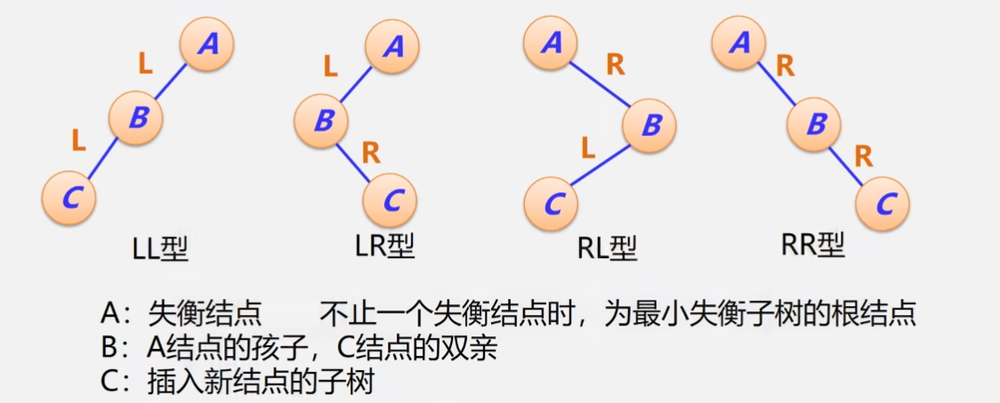
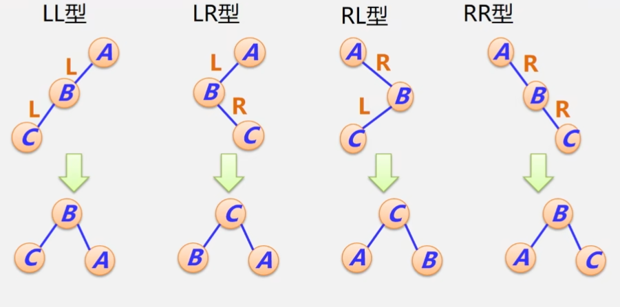

# 查找

查找表是由同一类型的数据元素或记录构成的集合，由于“集合”中的数据元素之间的关系十分松散，因此查找表是一种非常灵便的数据结构。

## 查找的相关概念

我们称实现了 Find, Read, Insert, Delete 的查找表为动态查找表。而实现了 Find, Read 的查找表为静态查找表。

关键字，或者键，是数据元素中用来表示一个数据元素的值。  
若此关键字可以唯一地表示一个记录，我们称该关键字为主关键字。此即是说，对于不同的记录，它们的主关键字一定均不同。反之，称用以识别若干记录的关键字为次关键字。   
当数据元素只有一个数据项时，关键字就是元素本身的值。

查找，是根据给定的某个值，在查找表中确定一个其关键字等于其给定值的记录或数据元素。若表中存在这样一个元素，则查找成功，反之查找不成功。

查找方法的实现取决于查找表的结构，即表中数据元素是如何组织在一起的。组织方式的不同会对查找的效率起决定性影响。接下来我们会研究不同数据结构上不同算法的查找效率，并尽可能提高它。

## 查找的效率

可以使用平均查找长度(Average Search Lengthm, ASL)衡量不同查找算法的好坏。  
详细地说，平均查找长度是指为了确定记录在查找表中的位置，需和给定值进行比较的关键字个数的期望值。  

对于含有 n 个记录的表，查找成功时的平均查找长度为  
$ASL=\sum^n_{i=1}P_iC_i$  
其中，$P_i$ 为查找表中第 i 个记录的概率。$C_i$ 为找到表中其关键字与给定值相等的第 i 个记录时，和给定值已经进行过的比较的关键字的个数。

# 线性表

顺序表或者线性链表表示的静态查找表。表内元素之间是无序的。

```cpp
struct ElemType {
    KeyType key;
    ... // 其他信息
}
struct SStable {
    ElemType *elem;
    int length;
}
```

## 顺序查找

这里不给出效率低的算法，而给出一种使用“哨兵”的高效算法。这种算法把待查关键字存入表头，在这种情况下，如果表中没有待查元素，则算法最终在哨兵处停下，并输出其下标 0。我们不需要检查 i 是否越界就能完成查找，这将带来可观的速度优化。

```cpp
int OrderSearch(SStable ST, KeyType key) {
    ST.elem[0].key = key;
    int i;
    for(i = ST.length; ST.elem[i].key != key; i--);
    return i;
}
```

对于该实现，查找第 i 个元素需要比较 n - i + 1 次。查找失败需要比较 n + 1 次。

$TimeComplexity=O(n)$  
$SpaceComplexity=O(1)$  
$ASL=\frac{1+n}{2}$

很多时候表中各个记录的查找概率并不相等，用户查找某些记录概率会多于其他记录的概率。  
如果能设法把查找概率高的记录放在靠近开始查找的位置，可以有效提高查找效率。  
然而，记录的查找概率很多时候难以理论推导或者提前测定。可以在记录中附设一个访问频度域，始终保持记录按非递增有序的次序排列，或者每次查找后均将刚查到的记录直接移至表头。

顺序查找是一种简单且对逻辑次序无要求的算法。但它的效率很低。

## 二分查找

二分查找要求线性表必须采用顺序存储结构，而且表中元素按关键字有序排列。在二分查找中，维护三个变量 lo，hi 和 mid。它们代表上界、下界、中点三个元素的下标。  
置 lo 为 1，置 hi 为表长，mid 为 (lo + hi) / 2。比较 mid 和 key 的大小关系。当它们相等，则函数返回 mid。如果 key < [mid]，则令 hi = mid - 1。如果 key > [mid]，则令 lo = mid + 1。如果出现了 hi < low 的情况，则说明查找失败。

该算法的迭代实现如下。

```cpp
int BinarySearch(SStable ST, KeyType key) {
    int lo = 1, hi = ST.length, mid;
    while(lo <= hi) {
        mid = (lo + hi) >> 1;
        if(key == ST.elem[mid].key) 
            return mid;
        else if(key < ST.elem[mid].key)
            hi = mid - 1;
        else if(key > ST.elem[mid].key)
            lo = mid + 1;
    }
    return 0;
}
```

该算法的递归实现如下。

```cpp
int BinarySearch(SStable ST, KeyType key, int lo, int hi) {
    if(lo > hi)
        return 0;
    mid = (lo + hi) >> 1;
    if(key == ST.elem[mid].key)
        return mid;
    else if(key < ST.elem[mid].key)
        return BinarySearch(ST, key, lo, mid - 1);
    else if(key > ST.elem[mid].key)
        return BinarySearch(ST, key, mid + 1, hi);
}
```


我们可以用一个二叉树来描述二分查找的过程。这样的二叉树叫做判定树或决策树。

判定树的根结点应该是 (lo + hi) / 2。这是首先被比较的结点。然后，根结点的左孩子应该是 (lo + mid) / 2，结点的右孩子应该是 (mid + hi) / 2。以此类推。  
寻找某元素所需的比较次数等于该元素在判定树的深度，也等于从根结点到该结点的路径所经过的结点数。在最坏情况下，查找所需要的比较次数为 $\lfloor log_2n\rfloor+1$。  

设表长 $n=2^h-1$，深度 $h=log_2(n+1)$，每个记录的查找概率相等。

$ASL=\sum_{i=1}^np_ic_i=\frac1n\sum ^n_{i=1}c_i\\=\frac1n\sum^h_{j=1}j2^{j-1}=\frac{n+1}nlog_2(n+1)-1$  

当 n 足够大时，可认为 $ASL=log_2(n+1)-1$。

折半查找法只适用于有序的顺序表，它于无序表或链表无效。

## 分块查找

分块查找是二分查找和顺序查找的改进。分块查找只要求索引表是有序的，对块内结点的序没有要求。分块查找的速度不如折半查找算法，但比顺序查找算法快得多，同时不需对全部节点进行排序。

当节点和块很多时，对索引表可以采用二分查找，这样能够进一步提高查找的速度。

分块查找将表分成了多块。对于第 i 块和第 j 块，若 i < j，则第 j 块中所有记录的关键字均大于第 i 块中的最大关键字。  
分块查找还建立了索引表。表中的每个块索引都含有最大关键字域和本块首结点的索引，且索引表按最大关键字有序。

一般情况下，为了进行分块查找，可以将长度为 n 的表均匀分成 b 块，每块含有 s 个记录，即 $b=\lceil\frac{n}{s}\rceil$。我们还假定每个块的查找概率均为 $\frac1b$，每个记录的查找概率均为 $\frac1s$，用二分查找确定所在块。

$ASL=L_b+l_w\thickapprox log_2(\frac{n}{s}+1)+\frac{s}2$

分块查找的插入和删除比较容易，无需进行大量改动。但是分块查找需要使用一个索引表，且需要对这个索引表进行排序运算。

# 树表

## 二叉排序树

二叉排序树(Binary Sort Tree, BST)又称二叉搜索树、二叉查找树。

二叉排序树或者是一棵空树，或者是满足下列性质的二叉树：
- 若其左子树非空，则左子树上所有结点的值均小于它的根结点的值。
- 若其右子树非空，则右子树上所有结点的值均大于等于它的根结点的值。
- 其左右子树也分别是二叉排序树。

中序遍历二叉排序树，将得到一个递增有序序列。

在实现二叉排序树上的查找操作时，先与根结点比较。若查找的关键字等于根结点，则成功。否则，若关键字小于根，则查找左子树；若关键字大于根，则查找右子树。

```cpp
struct ElemType{
    KeyType key;
    ... // 其他信息
};
typedef struct BSTNode{
    ElemType data;
    BSTNode *lchild, *rchild;
}*BSTree;
```

该算法的递归实现如下。

1. 若二叉排序树为空，则返回空指针。
2. 若二叉排序树非空，则将待查找值 key 与根结点的关键字 T->data.key 进行比较。
   1. 若 key 等于 T->data.key，则查找成功，返回根结点地址。 
   2. 若 key 小于 T->data.key，则进一步查找左子树。
   3. 若 key 大于 T->data.key，则进一步查找右子树。
   
```cpp
BSTree BSTSearch(BSTree root, KeyType key) {
    if(!root || key == key->data.key)
        return root;
    else if(key < root->data.key)
        return BSTSearch(root->lchild, key);
    else if(key > root->data.key)
        return BSTSearch(root->rchild, key);
}
```

二叉排序树上查找某关键字的过程相当于从根结点到该关键字结点处的路径。且，比较关键字次数等于结点所在的层数，最多比较次数等于树的深度。

含有 n 个结点的二叉排序树的平均查找长度与树的形态有关。

在最好情况下，树的深度为 $\lfloor log_2n\rfloor+1$，与二分查找的判定树深度相同。此时  
$TimeComplexity=O(logn)$  
$ASL=log_2(n+1)-1$

在最坏情况下，树的深度为 n，插入的 n 个元素在一开始就有序。此时  
$TimeComplexity=O(n)$  
$ASL=\frac{n+1}2$

### 插入

1. 若二叉排序树为空，则插入节点作为根结点插入到空树中。
2. 否则，继续在其左、右子树上查找。
   1. 若树中已有该元素，则不再插入。
   2. 若树中没有，则查找直至某个叶子结点的左子树或右子树为空。插入节点应为叶子节点的左孩子或者右孩子。

在插入过程中，需要维护两个指针 tmp 和 pre。tmp 指向待插入的地址，pre 指向 tmp 之前的地址。这样，当 tmp 为空，可以检测待插入元素 data 与 pre 的键值序，从而确定是插入到 pre 的左孩子还是右孩子上。

```cpp
Status Insert(BSTree root, ElemType data) {
    if(!root) {
        root = new BSTNode;
        root->data = data;
        root->lchild = nullptr;
        root->rchild = nullptr;
    }
    BSTree tmp = root;
    BSTree pre = nullptr;
    while(tmp) {
        pre = tmp;
        if(data.key == tmp->data.key)
            return OK;
        else if(data.key < tmp->data.key)
            tmp = tmp->lchild;
        else if(data.key > tmp->data.key)
            tmp = tmp->rchild;
    }
    if(data.key < pre->data.key) {
        pre->lchild = new BSTree;
        pre->lchild->data = data;
        pre->lchild->lchild = nullptr;
        pre->lchild->rchild = nullptr;
    } else if(data.key > pre->data.key) {
        pre->rchild = new BSTree;
        pre->rchild->data = data;
        pre->rchild->lchild = nullptr;
        pre->rchild->rchild = nullptr;
    }
    return OK;
}
```

### 生成

从空树出发，不断插入直至所有待搜索元素录入结点。一个无序序列可通过构造二叉排序树变为一个有序序列，构造树的过程就是对无序序列进行排序的过程。插入的节点都是叶子结点，因此无需移动其他的结点。

但是，关键字的输入顺序不同，建立的二叉排序树也不同，它们的效率也可能不同。

### 删除

从二叉排序树中删除一个结点，需要保证删除后所得的二叉树只减少了原结点，且应保证删除后所得的二叉树仍然满足二叉排序树的性质不变。

需要将因删除结点而断开的二叉树重新连接起来，并且需要防止连接后树的高度增加。

- 待删除的结点若是叶子结点，可以直接删去本结点。
- 待删除的结点若只有左子树或者只有右子树，则用其左子树或其右子树替换它。
- 若待删除的结点既有左子树，又有右子树，则
  - 用该结点的中序前驱进行值替换，随后删除此前驱结点。也可以用其中序后继进行值替换，随后删除此后继节点。

```cpp
Status Delete(BSTree root, ElemType data) {
    if(!root)
        return OK;
    else {
        if(data.key < root->data.key)
            Delete(root->lchild, data);
        else if(data.key > root->data.key)
            Delete(root->rchild, data);
        else if(data.key == root->data.key) {
            BSTree 
        }
    }
}
```

## 平衡二叉树

二叉排序树(Balanced Binary Tree or Height-Blanced Tree)又称 AVL 树。

二叉排序树或者是一棵空树，或者是满足以下性质的二叉排序树:
- 其左子树和右子树都是平衡二叉树。
- 左子树和右子树的深度差的绝对值小于等于 1。

为方便讨论，定义平衡因子(Balance Factor, BF)。  
平衡因子 = 结点左子树的高度 - 结点右子树的高度  
根据平衡二叉树的定义，平衡二叉树上的所有结点的平衡因子只能是 -1、0 或 1。

对于一棵有 n 个结点的平衡二叉树，其高度保持在 $O(log_2n)$ 量级，ASL 保持在 $O(log_2n)$ 量级。

### 失衡二叉排序树的分析与调整

在平衡二叉树上插入结点时，若整个树上出现了平衡因子绝对值大于 1 的结点，则称导致了失衡。此时需重新调整树的结构，使之重新平衡。



共有四种可能的失衡情况，已全部在上方列出。思考四种失衡分别如何调整。



无论如何，平衡调整应该保证把三个元素中，大小中等的元素排成根结点。然后，把较小者、较大者分别接在根结点的左孩子、右孩子上。

